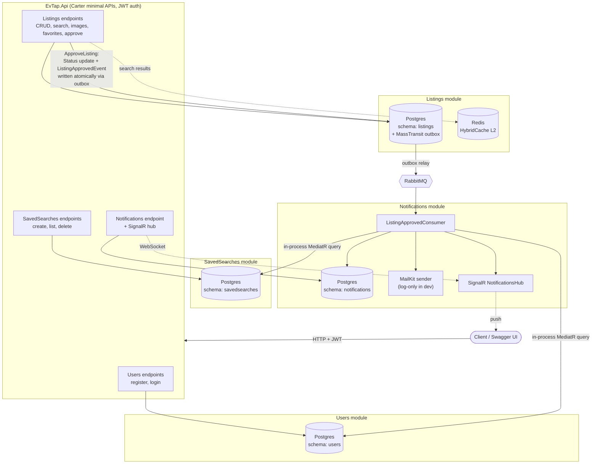

# EvTap

EvTap is a rental apartment listings platform backend, built as a portfolio project. Users post
listings, other users save search filters ("saved searches"), and when a new matching listing is
approved by an admin, they receive an email and a real-time in-app notification.

## Architecture

Modular monolith, Vertical Slice Architecture, CQRS via MediatR. Four independent modules —
`Users`, `Listings`, `SavedSearches`, `Notifications` — each with its own Postgres schema and
its own `DbContext`. Modules never reference each other's projects; cross-module communication
is either an integration event over RabbitMQ (publisher side uses a transactional outbox) or an
in-process MediatR read query against contracts defined in `EvTap.Shared.Contracts`.



### Key flow (showcase feature)

1. `POST /api/listings` → listing created with `Pending` status.
2. Admin calls `POST /api/listings/{id}/approve` → status set to `Active` **and**
   `ListingApprovedEvent` written to the outbox, in the same database transaction.
3. MassTransit relays the event from the outbox to RabbitMQ.
4. `ListingApprovedConsumer` in the Notifications module: finds active saved searches matching
   the listing (price/rooms/district) → sends an email (logged in dev, real SMTP if configured)
   and pushes a SignalR event to online users → writes `Notification` rows. Idempotent: a
   unique database index on `(UserId, ListingId, Channel)` plus a pre-check means a user is
   never notified twice for the same listing.

### Tech stack

- .NET 10, ASP.NET Core minimal APIs via **Carter** (no controllers)
- **MediatR** for CQRS, with `LoggingBehavior` + `ValidationBehavior` (FluentValidation) pipeline behaviors
- **EF Core** (Npgsql) — one `DbContext` and one Postgres schema per module
- **MassTransit + RabbitMQ**, EF Core transactional outbox on the publishing side
- **HybridCache** (in-memory L1 + Redis L2) on listing search
- **SignalR** for real-time push notifications
- **JWT bearer auth**, roles `User` / `Admin`
- **.NET Aspire** AppHost orchestrating Postgres, Redis, RabbitMQ and the API; OpenTelemetry +
  Serilog wired through Aspire's service defaults
- Result pattern (no exceptions for business-rule failures) mapped to HTTP via `ResultExtensions`
- xUnit + `Aspire.Hosting.Testing` (Testcontainers-backed Postgres/RabbitMQ) for integration tests

## Running locally

**Prerequisites:** .NET 10 SDK, Docker Desktop (WSL2 backend on Windows), the [Aspire CLI](https://aspire.dev/get-started/install-cli/) (optional, only needed for `aspire run`).

```bash
dotnet run --project src/EvTap.AppHost
```

This starts Postgres, Redis and RabbitMQ as containers and the API project, all orchestrated by
Aspire. On first run:

- Postgres/RabbitMQ use **fixed dev passwords** (set in `AppHost.cs`) so their data survives
  across restarts — see the `.WithDataVolume()` + `ContainerLifetime.Persistent` resources.
- Each module runs its own EF Core migrations automatically on startup (Development only).
- One admin user is seeded: `admin@evtap.local` / `Admin123!` (see `appsettings.Development.json`).

The console output prints the **Aspire Dashboard** URL with a login token
(`https://localhost:17270/login?t=...`) — open it to see every resource's status, logs, and the
API's actual (dynamically assigned) URL. From there, open `/swagger` on the API's URL for
interactive API docs with JWT bearer support built in (use the "Authorize" button after logging in).

### Running the tests

```bash
dotnet test tests/EvTap.IntegrationTests
```

This spins up the same AppHost (Postgres + RabbitMQ via Testcontainers) for a real end-to-end
run — no mocks — covering the auth flow and the full create → approve → notify flow.

## Endpoints

All endpoints return `application/json`. Errors follow RFC 9110 `ProblemDetails` via the shared
`Result` → HTTP mapping. 🔒 = requires `Authorization: Bearer <token>`. 👑 = requires the `Admin` role.

### Users

| Method | Route | Description |
|---|---|---|
| POST | `/api/users/register` | Create an account (role `User`) |
| POST | `/api/users/login` | Exchange credentials for a JWT |

### Listings

| Method | Route | Description |
|---|---|---|
| POST | `/api/listings` 🔒 | Create a listing (`Pending` status) |
| GET | `/api/listings` | Search active listings — query params: `minPrice`, `maxPrice`, `rooms`, `district`, `sortBy` (`price_asc`\|`price_desc`\|`newest`\|`oldest`), `page`, `pageSize`. Cached (HybridCache, 60s TTL, keyed by filters) |
| GET | `/api/listings/{id}` | Listing detail (increments view count) |
| PUT | `/api/listings/{id}` 🔒 | Update a listing (owner only) |
| DELETE | `/api/listings/{id}` 🔒 | Soft-delete a listing (owner only, sets `Removed`) |
| POST | `/api/listings/{id}/images` 🔒 | Upload images (`multipart/form-data`, field `files`; owner only) |
| POST | `/api/listings/{id}/favorite` 🔒 | Favorite a listing |
| DELETE | `/api/listings/{id}/favorite` 🔒 | Unfavorite a listing |
| POST | `/api/listings/{id}/approve` 🔒👑 | Approve a pending listing → publishes `ListingApprovedEvent` |

### Saved searches

| Method | Route | Description |
|---|---|---|
| POST | `/api/saved-searches` 🔒 | Save a search filter (at least one of `minPrice`/`maxPrice`/`minRooms`/`district` required) |
| GET | `/api/saved-searches` 🔒 | List the current user's saved searches |
| DELETE | `/api/saved-searches/{id}` 🔒 | Delete a saved search (owner only) |

### Notifications

| Method | Route | Description |
|---|---|---|
| GET | `/api/notifications` 🔒 | List the current user's notification history |
| WS | `/hubs/notifications` 🔒 | SignalR hub; connect with `?access_token=<jwt>`, listen for the `ListingMatched` event |

### Infrastructure

| Method | Route | Description |
|---|---|---|
| GET | `/swagger` | Swagger UI (Development only) |
| GET | `/health` | Full health check (Development only) |
| GET | `/alive` | Liveness check (Development only) |
